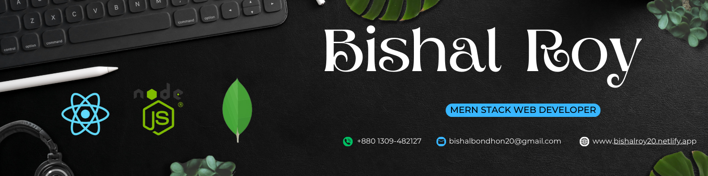

<a href="http://gitbanner.Saviru.qzz.io/" target="_blank">
  
</a>

```Hi there, I'm Bishal Roy. I'm a full-stack web developer with expertise in **React, Express.js, MongoDB, and Firebase Authentication (MERN stack)**. I focus on building scalable and user-friendly applications with clean code and responsive UI/UX. I’m passionate about learning new technologies, exploring modern React libraries, and integrating AI into projects. I’ve worked on production-level projects like e-commerce platforms and dashboards, and I also have experience in competitive programming. Feel free to contact me — I may be slow to respond, but I will surely reply.```

<br>


# Hi, I'm Bishal Roy 👋

🎓 Computer Science Student | 💻 MERN-Stack Developer | 🧠 DSA Enthusiast

## 🛠️ Tech Stack
- 💻 Languages: C++, Python, Java, JavaScript
- 🌐 Frontend: HTML, CSS, TailwindCSS, JavaScript , React js
- 🔧 Backend: Django , Express js
- 🛢️ Database: MySQL , Mongodb 
- 📚 Comfortable with Algorithms & Data Structures
- **Other:** Git, GitHub , FireBase Authentication
- NumPy, Pandas, Matplotlib

  
## 🌱 Currently
- Improving my problem-solving with LeetCode and Codeforces  
- Building full-stack Django apps  
- Learning frontend frameworks like React  
- Exploring open-source contributions


## 🔗 Connect with me
[LinkedIn](https://www.linkedin.com/in/bishal-roy-9aa81137b?utm_source=share&utm_campaign=share_via&utm_content=profile&utm_medium=android_app) | 
[Portfolio] | 
[Email](bishalbondhon20@gmail.com)


