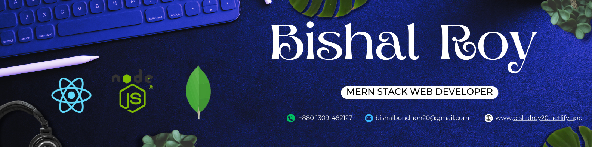

<!-- Banner -->

  

<!-- Animated Typing SVG -->

  

---

### 👋 Hi there, I'm **Bishal Roy**

I'm a **web developer** with expertise in **React, Express.js, MongoDB, and Firebase Authentication (MERN stack)**.  
I focus on building **scalable** and **user‑friendly applications** with **clean code** and **responsive UI/UX**.  

💡 Passionate about learning new technologies, exploring modern React libraries, and integrating AI into projects.  
🚀 Experienced in **production‑level projects** like **e‑commerce platforms** and **internal dashboards**.  
🏆 Background in **competitive programming**.  

---

### 📫 Reach Me Out

📬 Feel free to contact me — I may be slow to respond, but I will surely reply.

<!-- Wave Motion Divider -->

  

--

  

-- 

## 🚀 Skill Set

Here are the main technologies I use:

**Libraries and Frameworks**

|
|
|
|

**Tools**

|
|

**Programming Languages**

|
|
|
|

**Databases**

 

---

<!-- Animated Skill Icons Row -->
<!-- 

  

 -->

---

<!-- Wave Motion Divider -->

  

---

  
## Currently
- Making **websites and full‑stack applications** using **React, Express.js, Node.js, MongoDB, Firebase, Tailwind CSS, HTML, JavaScript, Python, and C++**
- Exploring **React libraries and frameworks** like **Next.js** to build modern, scalable apps
- Trying out **AI integration** in projects to add smart features and automation
- Building and refining **production‑level projects** for better **UI/UX** and **performance**
- Contributing to **open‑source projects** and learning new technologies to stay ahead

